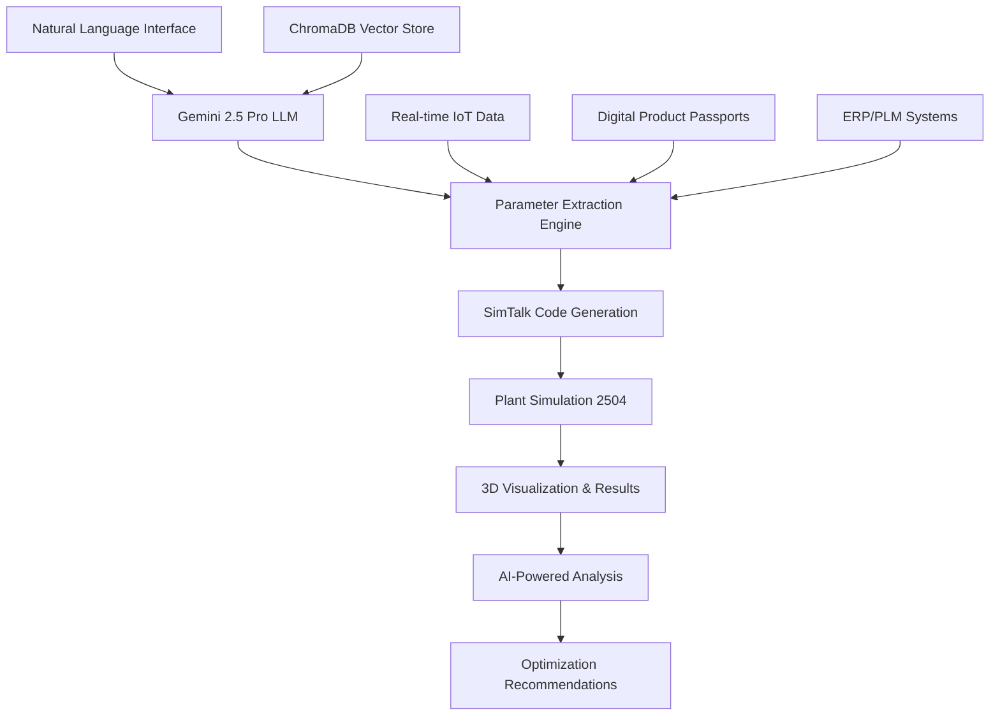

# ASMG Framework: Intelligent DES with Gemini 2.5 Pro

**Automatic Simulation Models Generation (ASMG) Framework**  
*An LLM-Augmented Discrete Event Simulation System for Manufacturing Optimization*

---

## 🎯 Overview

The **ASMG Framework** represents a groundbreaking approach to manufacturing simulation, combining the power of **Google Gemini 2.5 Pro** with **Siemens Plant Simulation 2504** to create an intelligent, natural language-driven discrete event simulation system. Originally developed for the **National Manufacturing Institute Scotland (NMIS)** "Intelligent Factory Planning" project, this framework enables manufacturers to optimize remanufacturing operations and de-risk investments in circular economy practices.

### 🧠 **Intelligent DES Framework Architecture**

## 🚀 Key Features

### **🤖 AI-Powered Simulation Generation**
- **Natural Language Processing**: Describe your manufacturing system in plain English
- **Intelligent Parameter Extraction**: AI automatically infers simulation parameters
- **Advanced SimTalk Generation**: Creates production-ready Plant Simulation code
- **Context-Aware Reasoning**: Leverages manufacturing knowledge base

### **🏭 Manufacturing Intelligence**
- **Remanufacturing Optimization**: Specialized for circular economy applications
- **Uncertainty Handling**: Advanced modeling of product return quality variability
- **Real-time Integration**: IoT sensors, ERP systems, and Digital Product Passports
- **Bottleneck Analysis**: AI-driven identification of system constraints

### **🔧 Technical Excellence**
- **Siemens Plant Simulation 2504**: Industry-standard simulation engine
- **Python 3.13.3**: Latest stable Python with enhanced performance
- **Docker Containerization**: Easy deployment and scalability
- **COM Interface**: Robust Windows integration with Plant Simulation
- **Vector Database**: ChromaDB for intelligent knowledge retrieval

## 🏗️ System Architecture

### **Five-Layer Intelligent Architecture**

1. **🌐 Data Ingestion Layer**
   - ERP/PLM system connectors
   - Digital Product Passport (DPP) API integration  
   - Real-time IoT data streams (MQTT, OPC UA)
   - Manufacturing database connections

2. **⚡ Data Processing & Standardization Layer**
   - Python-based data pipeline
   - B2MML/XML standardization
   - Real-time data cleaning and transformation
   - Unified data model creation

3. **🎮 Simulation Layer**
   - Siemens Technomatix Plant Simulation 2504
   - SimTalk code execution engine
   - 3D model generation and positioning
   - Advanced material flow modeling

4. **🧠 Intelligence Layer**
   - Google Gemini 2.5 Pro LLM
   - RAG (Retrieval-Augmented Generation)
   - Manufacturing knowledge base
   - Optimization algorithms

5. **👤 User Interface Layer**
   - Natural language interface
   - Web-based dashboard
   - Real-time visualization
   - API documentation
